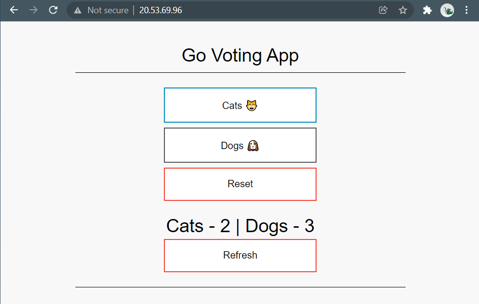

# Go Voting App

## Overview
A simple web app consisting of a Go (lang) server and Redis store, deployed to Azure Kubernetes Service (AKS).


## Voting
### POST a vote
    POST /vote/dogs
    # or 
    POST /vote/cats

### GET votes
    GET /votes

## Running on Docker
    docker-compose up -d

## Create a Kubernetes Cluster 
### Option 1: Create Kubernetes Cluster with Terraform
Create an AZ service principal. 

    az ad sp create-for-rbac --name <service_principal_name> --role Contributor

Store the result somewhere as we'll need `appId` and `password` later for `client_id` and `client_secret` respectively.

    $env:ARM_CLIENT_ID="<service_principal_app_id>"
    $env:ARM_SUBSCRIPTION_ID="<azure_subscription_id>"
    $env:ARM_TENANT_ID="<azure_subscription_tenant_id>"
    $env:ARM_CLIENT_SECRET="<service_principal_password>"
    $env:TR_VAR_client_secret="<service_principal_password>"
    $env:TR_VAR_client_id="<service_principal_app_id>"

Create the storage backend for terraform state.

    cd ./infra/create-remote-storage
    terraform init
    terrmaform apply

Copy the `storage account name` and an `access key` from the Azure CLI

    az storage account list --query "[].name"
    az storage account keys list --resource-group tfstate --account-name <account name>

Initialize terraform pointed to our new storage backend.

    $ terraform init -backend-config="storage_account_name=<account name>" -backend-config="container_name=tfstate" -backend-config="access_key=<access key>" -backend-config="key=codelab.microsoft.tfstate"
    ...
    You may now begin working with Terraform. 

Change to the infra directory

    cd ..

Verify that terraform will create the correct resources. 

    terraform plan -out out.plan

    ...
    Terraform will perform the following actions:

    # azurerm_kubernetes_cluster.k8s will be created
    + resource "azurerm_kubernetes_cluster" "k8s" {
    ...

Apply the terraform plan. This will take a long time, get yourself a drink.

    terraform apply out.plan

### Option 2: Crate Kubernetes cluster using Azure CLI
First you will need to setup a service principal which has the correct roles required to create the cluster and pull from the container registry.

Get full ACR id
```
az acr show --name bensacr --query "id"
```
Create a service principal, copy the <password> and username <appId> as you'll need these later.
```
az ad sp create-for-rbac --name acr-service-principal --scopes <acrName> --role acrpull --query "password"
az ad sp list --display-name acr-service-principal --query "[].appId"
```
Login to docker with the acr service principal.
```
docker login bensacr.azurecr.io --username <appId> --password=<password>
```

Finally, create the cluster!
```
az aks create --resource-group myResourceGroup --name myAKSCluster  --node-count 2 --generate-ssh-keys --attach-acr bensacr --service-principal <appId> --client-secret <password>
```

Install the AKS CLI (kubectl) 
    
    az aks install-cli

Configure kubectl with Azure credentials 

    az aks get-credentials --resource-group myResourceGroup --name myAKSCluster

List Nodes

```
$ kubectl get nodes
NAME                                STATUS   ROLES   AGE     VERSION
aks-nodepool1-10041079-vmss000000   Ready    agent   9m16s   v1.20.9
aks-nodepool1-10041079-vmss000001   Ready    agent   9m34s   v1.20.9
```

## Push app image to Azure container registry

Build and tag image
```
docker build --tag go-voting-app .
docker tag go-voting-app:latest bensacr.azurecr.io/go-voting-app:latest
```
Create a container registry. Note that `<acrName>` is your globally unique registry name.
```
az acr create --resource-group myResourceGroup --name <acrName> --sku Basic
```

Push to container registry
```
az acr login --name <acrName>
docker push <acrName>/go-voting-app:latest
```
Verify the image has been pushed
```
az acr repository list --name <acrName> --output table
```

## Deploy to Kubernetes
Create a new k8s deployment

    $ kubectl apply -f .\deployment.yaml
    deployment.apps/voting-redis created
    service/voting-redis created
    deployment.apps/go-voting-app created
    service/go-voting-app created

Obtain the external IP

    $ kubectl get service go-voting-app
    NAME            TYPE           CLUSTER-IP     EXTERNAL-IP      PORT(S)        AGE
    go-voting-app   LoadBalancer   10.0.225.190   52.226.211.179   80:31742/TCP   101s

Check that the website is up and running at the external IP of the service



In future it would be nice to have more production ready features like k8s ingress and a dns name.